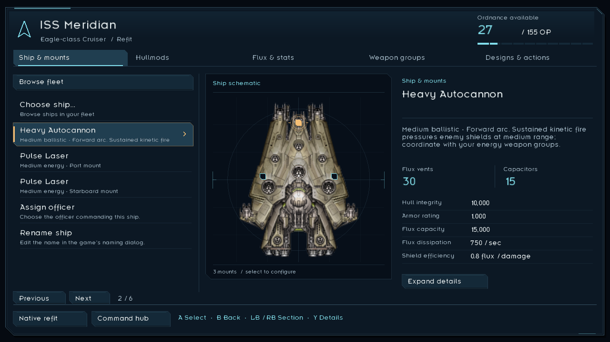
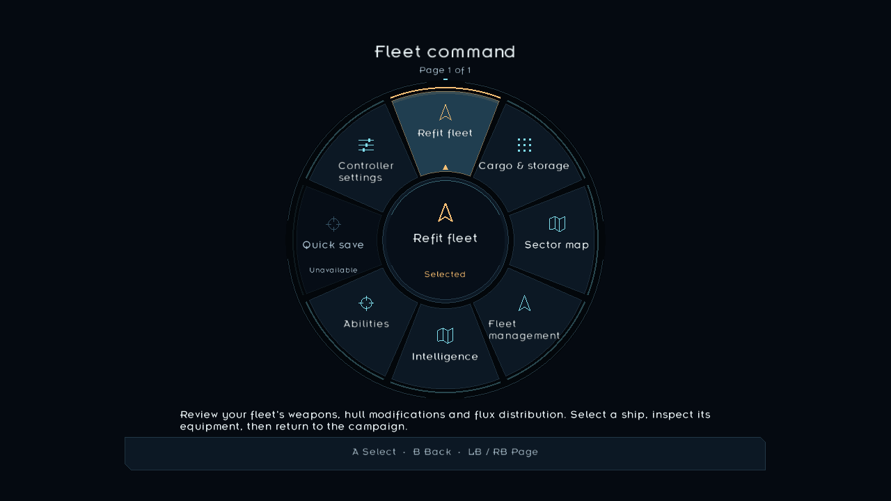
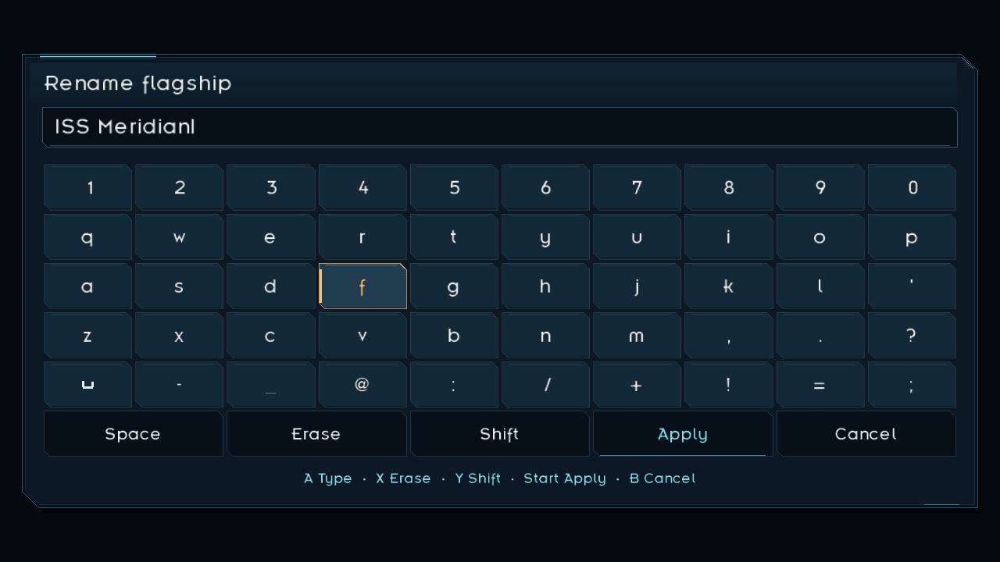

# TriPad instrument-panel refinement

SectorPad 1.3.0 draws on the clear instruments and layered displays of Star Citizen and Mass Effect while keeping Starsector's compact tactical layout and Insignia typography. Its geometry is original. The native skin is loaded through the mod's existing asset paths, and the richer refit, radial and keyboard drawing belongs to SectorPad's own panels. Installed game content is not edited.

## Visual system

The main surface is navy `#0c1824`, with darker `#070f19` recesses and steel `#355264` structure. Control surfaces use `#142938`; selected surfaces use `#203e50`. Pale cyan `#80ddeb` marks interactive structure and hover, amber `#f6bf75` marks controller focus, and pale `#e6f0f4` / muted `#a1b8c8` text preserves readable contrast. The existing automated contrast checks cover primary, muted, selected and prompt text.

The strongest shape belongs to the radial: separated edge segments, a recessed centre, function-specific glyphs and an amber selected sector. Refit and setup use quieter surfaces so equipment names and data take priority. The refit schematic centres the ship, locates real mount markers and adds a stronger cue only to the selected mount. OP allocation and section selection remain distinct from individual row focus.

The keyboard separates character entry from Space, Erase, Shift, Apply and Cancel. Its selected key shares the same clipped focus details as Controller Setup. Pointer brackets remain outside the existing cursor; precision and locked aim receive broken arcs with a clear central aim point. No new continuous animation, scanline texture, decorative status text or franchise artwork is introduced.

## Offscreen rendering evidence

These are actual runtime OpenGL renders with the installed Starsector fonts and ship sprite, using synthetic fixture data on a neutral background. They are not live gameplay screenshots. The screenshots show the same production OverlayRenderer and RefitWorkspace classes that ship in the mod; a test-only resource adapter supplies read-only local textures. Native game UI composition and full LunaLib mounting require separate in-game verification.







The harness passed 865 assertions on an AMD Radeon RX 9070 XT, checking 1280×720, 1280×800 and 1920×1080 at requested scales 1.0 and 1.8. It verifies keyboard and radial hit correspondence, refit target bounds and restoration of the calling OpenGL state. The keyboard layout still owns both hit geometry and console dock clearance. Rendering reads resources from the installation and writes only review output under `build/ui-review`; the three screenshots above were retained separately as documentation evidence.

To reproduce after preparing dependencies with the normal build:

```text
python tools/build.py
python tools/ui_review.py
python tools/generate-hud-theme.py --check --preview build/modern-hud-preview.png
```

The offscreen tool needs the local game, LunaLib, LazyLib and a working LWJGL Pbuffer implementation. It has no visible-window fallback. The source package includes the harness, but does not include game fonts, ship textures or copied game libraries. Its default Windows installation path can be replaced with `--game`.

## Native skin boundary

The same 57 verified panel, border, tab and chassis paths are used. Transparent centre tiles, tile gutters, side cutouts and the native power-button aperture remain intact. Only original mod-provided frame artwork and the existing session UI palette change; native text, indicators, icons, warning symbols, input semantics and saves retain their original behavior. [HUD skin coverage](HUD_SKIN.md) lists every family and compatibility boundary.

Only one native HUD skin should be enabled at a time. AashPad and SectorPad overlap resource paths and the player UI palette. The offscreen previews do not establish which skin would win in a mixed-mod launch, nor validate every native or third-party screen. See [the compatibility report](COMPATIBILITY.md) for the exact verification boundaries.
